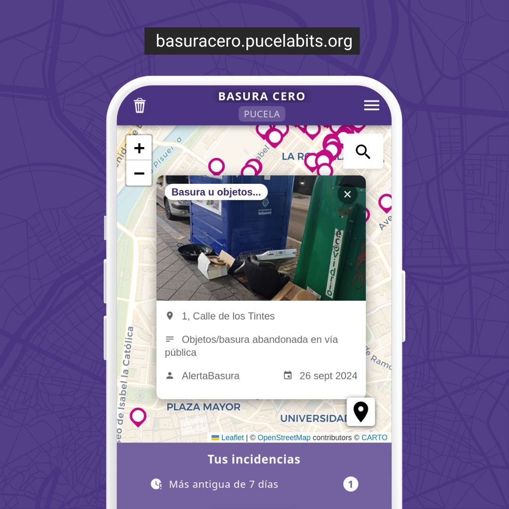
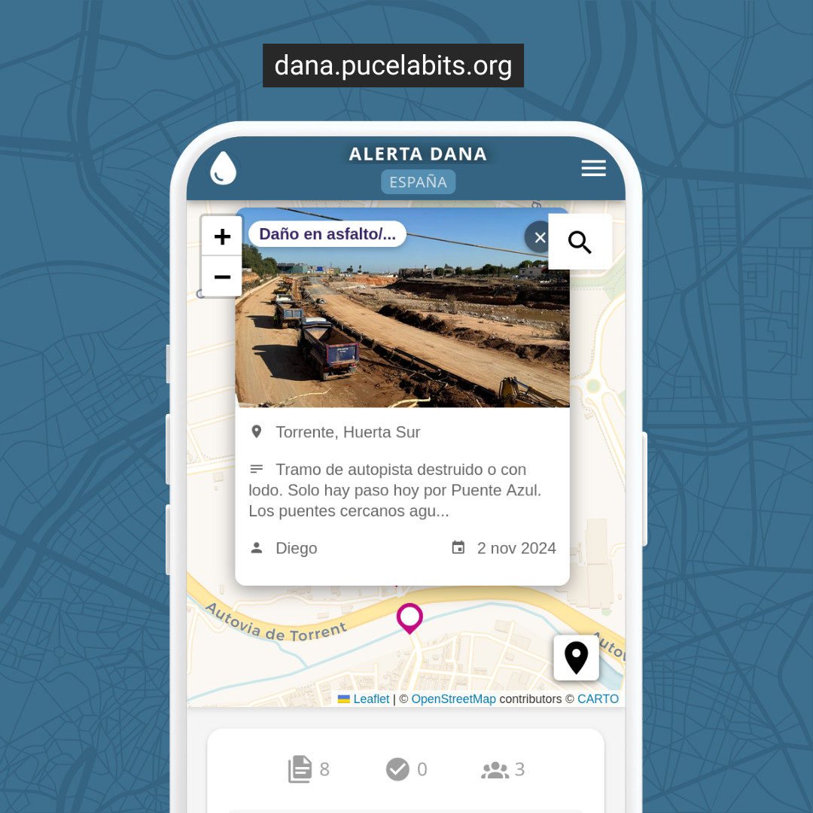

## **Basura Cero: La app para mejorar tu ciudad, pueblo o barrio**

**Basura Cero** es una plataforma sencilla para generar una web app colaborativa que permita reportar incidencias o problemas sin solucionar en un área concreta, como basura, baches, áreas verdes descuidadas, etc. Con solo unos clics, los vecinos pueden ayudar a reclamar que su zona esté más limpia y en mejores condiciones. 

**Juntos, podemos exigir que nuestra zona sea un lugar más agradable para todos**

La configuración por defecto acepta incidencias en la ciudad de Valladolid, pero puedes modificarla para que acepte incidencias de cualquier otra zona o usando otras categorías.

**Instancias que usan esta plataforma**



[Basura Cero Valladolid](https://basuracero.pucelabits.org) - Incidencias sin resolver en via pública



[Alerta DANA](https://dana.pucelabits.org) - Documentación de incidencias provocadas por la DANA 2024 en España


### **¿Cómo funciona?**

1. **Reporta problemas fácilmente**:
   - ¿Has visto algo que lleva tiempo sin arreglar? Toma una foto, selecciona el tipo de problema y márcalo en el mapa. ¡Así de rápido!
   
2. **Mapa interactivo**:
   - Visualiza todas las incidencias reportadas en un mapa sencillo y práctico. Podrás ver qué problemas ya se están resolviendo.

3. **Soluciones a tu alcance**:
   - Informa si un problema ya ha sido solucionado y vota si realmente está resuelto. ¡Tu opinión cuenta!

4. **Geolocalización automática**:
   - La app detecta automáticamente tu ubicación para hacer el reporte más rápido. O elige la ubicación manualmente si lo prefieres.

5. **Informar a un número de WhatsApp oficial**:
   - Puedes registrar una incidencia oficialmente con el WhatsApp del organismo responsable, solo con un clic te mandamos a su WhatsApp con los datos ya rellenados.

6. **Diseño adaptable**:
   - Usala desde tu móvil, tablet u ordenador, ¡cuándo y dónde quieras!

### **¿Por qué usar la plataforma Basura Cero?**

- **Rápido y sencillo**: Solo necesitas unos segundos para reportar un problema y contribuir a una ciudad mejor.
- **Colaborativo**: Todos los ciudadanos participan para que nuestra ciudad esté más limpia y en buen estado.
- **Transparente**: Consulta fácilmente el estado de los reportes y los solucionados.
- **Seguro**: No compartimos tus datos personales con nadie.

Al usar **Basura Cero**, no solo reportas problemas, sino que también ayudas a visibilizarlos y a asegurar que se solucionen. Además, puedes habilitar un botón para enviar tus reportes directamente al sistema oficial del ayuntamiento.

## Configuración

**Antes de empezar**

Antes de ejecutar la aplicación, asegúrate de hacer una copia del archivo `.env.sample` a `.env`:

```bash
cp .env.sample .env
```

En el archivo `.env` podrás configurar:

### Información básica
- `APP_NAME`: Nombre de la aplicación
- `APP_SUBTITLE`: Subtítulo de la aplicación
- `APP_DESCRIPTION`: Descripción del proyecto
- `BASE_URL`: URL base de la aplicación (varía según el entorno)

### Límites geográficos
Define el área en la que se pueden reportar incidencias:
- `CIUDAD_LAT_MIN`: Latitud mínima
- `CIUDAD_LAT_MAX`: Latitud máxima
- `CIUDAD_LON_MIN`: Longitud mínima
- `CIUDAD_LON_MAX`: Longitud máxima

### Configuración de reportes
- `REPORTES_PARA_SOLUCIONAR`: Número de reportes necesarios para marcar una incidencia como solucionada
- `DIAS_PARA_CONSIDERAR_ANTIGUA`: Días tras los cuales una incidencia se considera antigua
- `REPORTES_PARA_SOLUCIONAR_ANTIGUA`: Número de reportes necesarios para solucionar una incidencia antigua

### Personalización visual
- `APP_FAVICON_PATH`: Ruta al favicon (por defecto "/img/default/favicon.png")
- `APP_LOGO_PATH`: Ruta al logo (por defecto "/img/default/logo.png")

Puedes colocar tus propias imágenes en la carpeta `public/img/custom/` (no incluyas `/public/` en la ruta del config).

### Colores de la aplicación
- `APP_PRIMARY_COLOR`: Color principal
- `APP_SECONDARY_COLOR`: Color secundario
- `APP_SUCCESS_COLOR`: Color para éxitos
- `APP_ERROR_COLOR`: Color para errores
- `APP_WARNING_COLOR`: Color para advertencias
- `APP_INFO_COLOR`: Color para información
- `APP_BACKGROUND_COLOR`: Color de fondo

### Enlaces sociales
Configura los enlaces a redes sociales y otros recursos mediante `APP_SOCIAL_LINKS`. Debe ser un array JSON con objetos que contengan:
- `name`: Nombre del enlace
- `url`: URL del enlace
- `icon`: Icono de Material Design Icons a mostrar

### Tipos de incidencias
Define los tipos de incidencias iniciales en `TIPOS_INCIDENCIAS_INICIALES`, podrás definir un icono personalizado para cada tipo.

Una vez iniciada la aplicación, puedes gestionar los tipos usando:
```bash
# Listar tipos existentes
npm run tipos ls

# Añadir nuevo tipo
npm run tipos add "Nuevo tipo de incidencia"

# Editar tipo existente
npm run tipos edit ID "Nuevo nombre"

# Eliminar tipo
npm run tipos remove ID
```

Si añades nuevos tipos a posteriori, no olvides actualizar el array `TIPOS_INCIDENCIAS_INICIALES` en el archivo `.env` con su nombre e icono (opcional).

### Captcha (opcional)
Configura [Friendly Captcha](https://friendlycaptcha.com/) para proteger los formularios:
- `friendlycaptcha_enabled`: Activa/desactiva el captcha
- `VITE_FRIENDLYCAPTCHA_SITEKEY`: Clave pública
- `friendlycaptcha_secret`: Clave secreta de la API

### Analytics (opcional)
Configura el analytics de la aplicación:

- `VITE_ANALYTICS_PROVIDER`: Define qué proveedores de analytics usar. Opciones:
  - `none`: Sin analytics
  - `matomo`: Solo Matomo
  - `google`: Solo Google Analytics
  - `matomo,google`: Ambos proveedores

Configuración para Matomo:
- `VITE_MATOMO_URL`: URL de tu instalación de Matomo
- `VITE_MATOMO_SITE_ID`: ID del sitio en Matomo

Configuración para Google Analytics:
- `VITE_GA_ID`: ID de Google Analytics (formato: G-XXXXXXXXXX)

### Directorios necesarios
Crea las carpetas necesarias para el funcionamiento:

```bash
mkdir uploads data
```

### Configuración del plugin de WhatsApp (opcional)

Permite tener un botón en las incidencias para enviar la descripción y ubicación a un número de WhatsApp.

- `VITE_WHATSAPP_SHARE_ENABLED`: Activa o desactiva la funcionalidad de compartir por WhatsApp (true/false)
- `VITE_WHATSAPP_SHARE_PHONE`: Número de teléfono al que se enviará el mensaje (formato: 34666666666)
- `VITE_WHATSAPP_SHARE_BUTTON_TEXT`: Texto del botón de compartir
- `VITE_WHATSAPP_SHARE_DIALOG_TITLE`: Título del diálogo de confirmación
- `VITE_WHATSAPP_SHARE_DIALOG_TEXT`: Texto principal del diálogo
- `VITE_WHATSAPP_SHARE_DIALOG_NOTE`: Texto de la nota adicional en el diálogo

### Textos personalizables
- `VITE_TEXTO_BOTON_RESOLVER`: Texto para el botón de resolver incidencias (por defecto "Resolver")
- `VITE_TEXTO_ESTADO_SOLUCIONADO`: Texto para el estado de solucionado (por defecto "Solucionada")

## Ejecución en producción con Docker

Para ejecutar la aplicación en producción utilizando Docker, sigue estos pasos:

1. Asegúrate de tener Git y Docker instalados en tu sistema.

2. Clona este repositorio:
   ```
   git clone https://github.com/pucelabits/basura-cero.git
   cd basura-cero-pucela
   ```
3. Sigue las instrucciones en la sección [Configuración](#configuración).

4. Construye y ejecuta el contenedor Docker:
   ```
   docker compose up --build
   ```

La aplicación estará disponible en `http://localhost:5050`.

### Scripts de mantenimiento

- `docker-compose exec basuracero-app npm run incidencia remove ID`: Borra una incidencia por su ID.
- `docker-compose exec basuracero-app npm run incidencia edit-tipo ID TIPO_ID`: Cambia el tipo de una incidencia.
- `docker-compose exec basuracero-app npm run tipos`: Gestiona los tipos de incidencias.
- `docker-compose exec basuracero-app npm run rellenar-direcciones`: Actualiza las direcciones de las incidencias que no tienen una dirección asignada.
- `docker-compose exec basuracero-app npm run rellenar-barrios`: Actualiza los barrios de las incidencias que no tienen un barrio asignado.
- `docker-compose exec basuracero-app npm run asignar-imagen ID RUTA_IMAGEN`: Asigna una imagen a una incidencia específica.
- `docker-compose exec basuracero-app npm run solucionar-antiguas [-- opciones]`: Soluciona automáticamente incidencias antiguas con votos.

#### Script para solucionar incidencias antiguas

Este script permite marcar automáticamente como solucionadas las incidencias que cumplan ciertos criterios de antigüedad y votos de solución.

**Uso básico:**
```bash
# Ejecutar con valores por defecto (90 días, 1 voto mínimo)
docker-compose exec basuracero-app npm run solucionar-antiguas

# Solo ver qué incidencias se solucionarían (sin hacer cambios)
docker-compose exec basuracero-app npm run solucionar-antiguas -- --dry-run

# Personalizar criterios
docker-compose exec basuracero-app npm run solucionar-antiguas -- --dias 180 --votos 2
```

**Opciones disponibles:**
- `--dias <numero>`: Número de días de antigüedad mínima (por defecto: 90)
- `--votos <numero>`: Número mínimo de votos de solución (por defecto: 1)
- `--dry-run`: Solo mostrar qué se haría sin ejecutar cambios
- `--help`: Mostrar ayuda detallada

### Feeds RSS

La app expone los siguientes feeds RSS:

- `/api/rss`: Últimas incidencias añadidas a la app.
- `/api/rss/spam`: Últimos reportes de contenido inadecuado.

Puedes usar esos feeds para integraciones con otras aplicaciones, como un bot de avisos en telegram o importación en redes sociales.

### Dominio personalizado

Puedes hacer accesible la web desde un proxy con Nginx usando un dominio personalizado.

Ejemplo que incluye el cache de diferentes rutas y asume que has creado un certificado SSL con [certbot de Let's Encrypt](https://certbot.eff.org/).

```
server {
    listen 443 ssl;
    server_name basuracero.pucelabits.org;
    access_log /var/log/nginx/basuracero.pucelabits.org.access.log;
    error_log /var/log/nginx/basuracero.pucelabits.org.error.log;

    ssl_certificate      /etc/letsencrypt/live/basuracero.pucelabits.org/fullchain.pem;
    ssl_certificate_key  /etc/letsencrypt/live/basuracero.pucelabits.org/privkey.pem;
    ssl_trusted_certificate /etc/letsencrypt/live/basuracero.pucelabits.org/chain.pem;

    ssl_session_timeout 1d;
    ssl_protocols TLSv1.2;
    ssl_prefer_server_ciphers off;

    # HSTS (ngx_http_headers_module is required) (15768000 seconds = 6 months)
    add_header Strict-Transport-Security "max-age=63072000; includeSubDomains; preload" always;
    add_header X-Content-Type-Options 'nosniff';
    add_header X-Frame-Options 'SAMEORIGIN';
    add_header X-XSS-Protection '1; mode=block';
    # OCSP Stapling ---
    # fetch OCSP records from URL in ssl_certificate and cache them
    ssl_stapling on;
    ssl_stapling_verify on;

    ## verify chain of trust of OCSP response using Root CA and Intermediate certs
    resolver 208.67.222.222 208.67.220.220;


    # Agrega el encabezado CORS para todas las ubicaciones
    add_header 'Access-Control-Allow-Origin' '*';

    # Archivos estáticos incluyendo assets
    location ~* ^/(assets/.*\.(js|css|png|jpg|jpeg|gif|ico|svg)|.*\.(js|css|png|jpg|jpeg|gif|ico|svg))$ {
        proxy_pass http://localhost:5050;
        expires 30d;
        add_header Cache-Control "public, max-age=2592000, immutable";
        proxy_cache my_cache;
        proxy_cache_valid 200 30d;
        proxy_cache_use_stale error timeout http_500 http_502 http_503 http_504;
    }

    # Manejo específico para index.html (sin cache)
    location = /index.html {
        proxy_pass http://localhost:5050;
        expires -1;
        add_header Cache-Control "no-cache, no-store, must-revalidate";
    }

    # Tipos de incidencias
    location /api/incidencias/tipos {
        proxy_pass http://localhost:5050;
        proxy_cache my_cache;
        proxy_cache_valid 200 1h;
        proxy_cache_use_stale error timeout http_500 http_502 http_503 http_504;
    }

    # Obtener todas las incidencias
    location /api/incidencias/todas {
        proxy_pass http://localhost:5050;
        proxy_cache my_cache;
        proxy_cache_valid 200 1m;
        proxy_cache_use_stale error timeout http_500 http_502 http_503 http_504;
    }

    # Obtener incidencias paginadas (con bypass de caché)
    location /api/incidencias {
        proxy_pass http://localhost:5050;
        proxy_http_version 1.1;
        proxy_set_header Upgrade $http_upgrade;
        proxy_set_header Connection 'upgrade';
        proxy_set_header X-Real-IP $remote_addr;
        proxy_set_header X-Forwarded-For $proxy_add_x_forwarded_for;
        proxy_set_header Host $host;
        proxy_set_header X-Forwarded-Proto $scheme;
        proxy_cache my_cache;
        proxy_cache_valid 200 1m;
        proxy_cache_use_stale error timeout http_500 http_502 http_503 http_504;
        proxy_cache_bypass $query_string;
        proxy_no_cache $query_string;
    }

    # Ranking de usuarios
    location /api/incidencias/usuarios/ranking {
        proxy_pass http://localhost:5050;
        proxy_cache my_cache;
        proxy_cache_valid 200 1h;
        proxy_cache_use_stale error timeout http_500 http_502 http_503 http_504;
    }

    # Ranking de barrios
    location /api/incidencias/barrios/ranking {
        proxy_pass http://localhost:5050;
        proxy_cache my_cache;
        proxy_cache_valid 200 1h;
        proxy_cache_use_stale error timeout http_500 http_502 http_503 http_504;
    }

    # Archivos estáticos en uploads
    location /uploads/ {
        proxy_pass http://localhost:5050;
        proxy_cache my_cache;
        proxy_cache_valid 200 24h;
        proxy_cache_use_stale error timeout http_500 http_502 http_503 http_504;
    }

    # Configuración general para otras rutas
    location / {
        proxy_pass http://localhost:5050;
        proxy_http_version 1.1;
        proxy_set_header Upgrade $http_upgrade;
        proxy_set_header Connection 'upgrade';
        proxy_set_header X-Real-IP $remote_addr;
        proxy_set_header X-Forwarded-For $proxy_add_x_forwarded_for;
        proxy_set_header Host $host;
        proxy_set_header X-Forwarded-Proto $scheme;
        
        # Intenta servir el archivo directamente, si no, pasa la solicitud a la aplicación
        try_files $uri $uri/ @app;
    }

    location @app {
        proxy_pass http://localhost:5050;
    }
}
```

## Ejecución local para desarrollo

Para ejecutar la aplicación localmente en modo de desarrollo, sigue estos pasos:

1. Asegúrate de tener Node.js (versión 22 o superior) instalado en tu sistema.

2. Clona este repositorio:
   ```
   git clone https://github.com/pucelabits/basura-cero.git
   cd basura-cero-pucela
   ```

3. Instala las dependencias:
   ```
   npm install
   ```

4. Inicia el servidor de desarrollo:
   ```
   npm run dev:server
   ```

5. En otra terminal, inicia el cliente de desarrollo:
   ```
   npm run dev:client
   ```

6. La aplicación estará disponible en `http://localhost:5173`.

### Scripts disponibles

- `npm run start`: Inicia el servidor en modo producción.
- `npm run dev:server`: Inicia el servidor en modo desarrollo con hot-reload.
- `npm run dev:client`: Inicia el cliente en modo desarrollo con hot-reload.
- `npm run build`: Construye la aplicación para producción.
- `npm run incidencia remove ID`: Borra una incidencia por su ID.
- `npm run incidencia edit-tipo ID TIPO_ID`: Cambia el tipo de una incidencia.
- `npm run tipos`: Gestiona los tipos de incidencias (listar, añadir, editar, eliminar y reasignar).
- `npm run solucionar-antiguas [-- opciones]`: Soluciona automáticamente incidencias antiguas con votos.

### Notas adicionales

- Asegúrate de que el puerto 5173 esté disponible en tu sistema.
- La base de datos SQLite se creará automáticamente en la carpeta `data` al iniciar la aplicación.
- Las imágenes subidas se almacenarán en la carpeta `uploads`.
- En desarrollo, el servidor proxy de Vite redirigirá las peticiones API al servidor backend.

Para más detalles sobre la configuración y el desarrollo, consulta los archivos `package.json`, `docker-compose.yml`, `Dockerfile` y `vite.config.js`.

### Estructura del proyecto

- `src/client`: Contiene el código fuente del cliente Vue.js.
- `src/server`: Contiene el código fuente del servidor Express.js.
- `src/server/routes`: Definiciones de las rutas API.
- `src/server/config`: Configuración de la base de datos.
- `scripts`: Scripts para la gestión de la aplicación.
- `public`: Archivos estáticos como imágenes.
- `uploads`: Directorio para almacenar las imágenes subidas.
- `data`: Directorio para la base de datos SQLite.

## Contribuciones

Las contribuciones son bienvenidas. Por favor, [abre un issue](https://github.com/PucelaBits/basuracero/issues) para informar de errores o sugerir cambios y mejoras.

## Licencia

El código fuente de esta aplicación está licenciado bajo la [AGPL v3](https://www.gnu.org/licenses/agpl-3.0.html). Si reutilizas o modificas el código, debes:

- Mantener la misma licencia AGPL v3.
- Proporcionar un enlace al código fuente original.
- Hacer público el código fuente modificado bajo la misma licencia.

Además, si usas el software modificado en un servidor accesible al público, debes ofrecer el acceso al código fuente a los usuarios de ese servidor.

Puedes definir una licencia para el contenido que suban los usuarios a tu instancia, modificando el enlace a la licencia en el archivo `.env`.