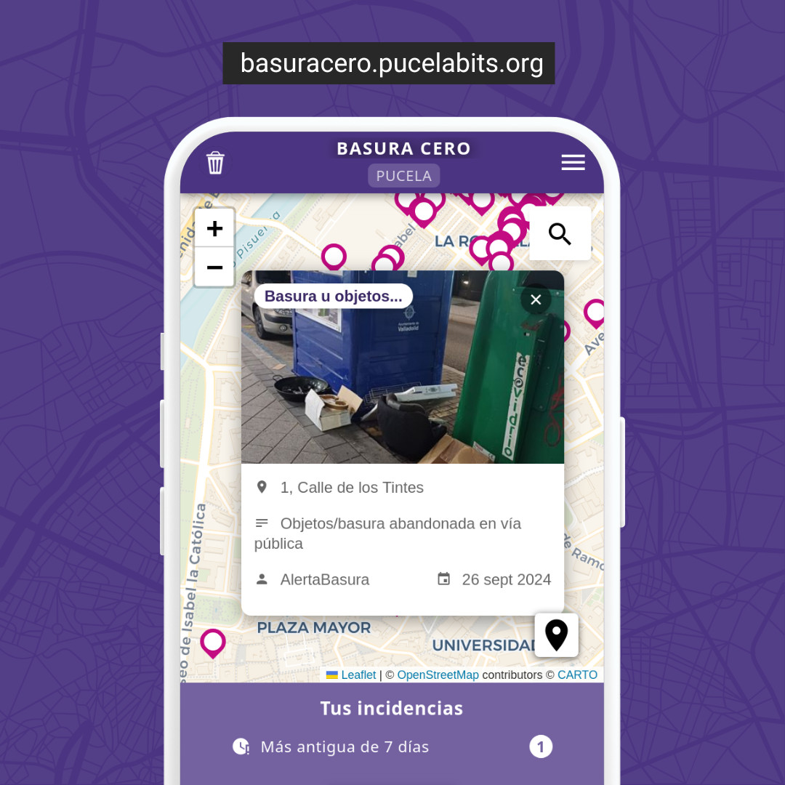
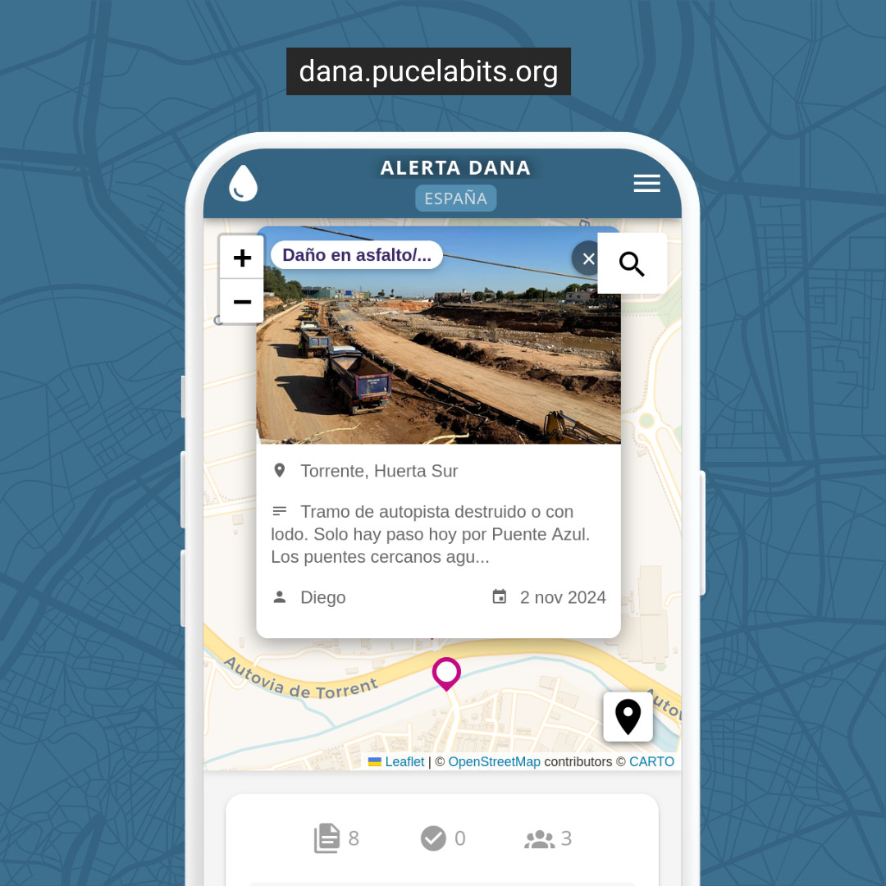

# Basura Cero

**Basura Cero** es una plataforma colaborativa para visibilizar incidencias sin resolver en una ciudad, pueblo o barrio. Permite publicar avisos con fotografía y ubicación, consultarlos en un mapa y comunicar cuándo se han solucionado.

La aplicación incluye un panel de administración pensado para que la gestión cotidiana no requiera editar archivos, acceder a SQLite ni ejecutar comandos en el servidor.

## Instancias que utilizan la plataforma

<p>
  
  
</p>

- [Basura Cero Valladolid](https://basuracero.pucelabits.org): incidencias sin resolver en la vía pública.
- [Alerta DANA](https://dana.pucelabits.org): documentación de incidencias provocadas por la DANA de 2024.

## Qué ofrece

- Registro de incidencias con fotografía, categoría y ubicación.
- Mapa, buscador, filtros, barrios, favoritas e incidencias cercanas.
- Votos vecinales para indicar que una incidencia está solucionada.
- Umbrales distintos para incidencias recientes y antiguas.
- Envío opcional al WhatsApp del organismo responsable.
- Moderación de contenido y operaciones masivas.
- Interfaz adaptable a móvil, tableta y ordenador.
- Feeds RSS para integraciones externas.

## Administración sin conocimientos técnicos

El panel está disponible en `/admin`. Desde él se puede gestionar prácticamente toda la actividad y personalización de la instancia.

| Sección | Qué permite hacer |
| --- | --- |
| Vista general | Consultar métricas, actividad reciente y accesos rápidos. |
| Incidencias | Buscar, filtrar, ordenar, editar, cambiar estado o categoría y ejecutar acciones masivas. |
| Categorías | Crear, renombrar, elegir iconos, fusionar y eliminar categorías sin uso. |
| Mantenimiento | Revisar incidencias antiguas, moderar reportes inadecuados y completar ubicaciones pendientes. |
| Configuración | Cambiar identidad, logotipo, icono, colores, textos, enlaces, mapa, proximidad, resolución, WhatsApp, CAPTCHA y analítica. |
| Administradores | Crear cuentas, bloquear accesos y forzar cambios de contraseña. |
| Auditoría | Consultar quién realizó cada acción administrativa. |

Los formularios de configuración se guardan por secciones y no obligan a volver al principio de la página. Los cambios públicos se sirven en tiempo de ejecución; normalmente basta con recargar la web pública.

### Primeros pasos desde el panel

1. Accede a `https://TU_DOMINIO/admin`.
2. Cambia la contraseña temporal si es el primer acceso.
3. Abre **Configuración** y completa cada bloque.
4. Revisa **Categorías** y adapta los tipos de incidencia a tu proyecto.
5. Crea las demás cuentas en **Administradores**.
6. Comprueba la web pública desde móvil y ordenador.

El panel es la vía recomendada: valida los datos, protege las acciones sensibles y deja constancia en auditoría.

## Instalación nueva con Docker

Requisitos: Git, Docker y Docker Compose v2.

```bash
git clone https://github.com/PucelaBits/basuracero.git
cd basuracero
cp .env.sample .env
mkdir -p data uploads
```

Antes del primer arranque edita únicamente los valores operativos esenciales de `.env`:

```dotenv
BASE_URL=https://incidencias.ejemplo.org
ADMIN_BOOTSTRAP_USERNAME=admin
TRUST_PROXY=1
```

Usa `TRUST_PROXY=1` solo cuando haya un único proxy inverso de confianza delante de la aplicación. Si Node recibe tráfico directamente, conserva `TRUST_PROXY=false`.

Instala y arranca el servicio:

```bash
./scripts/install.sh
docker compose ps
```

El asistente genera automáticamente `SESSION_SECRET`, crea el primer administrador en un contenedor efímero y muestra su contraseña temporal una sola vez. Después limpia la credencial de bootstrap y arranca el servicio definitivo sin ella. La instalación local queda disponible por defecto en `http://localhost:5050`; entra en `/admin` y cambia la contraseña temporal cuando se solicite. No es necesario volver a editar `.env` ni recrear el servicio.

## Actualizar una instalación existente

Una instalación creada antes de incorporar el panel mantiene `/admin` desactivado hasta que el operador lo habilita expresamente.

```bash
git pull --ff-only origin main
./scripts/enable_admin.sh
```

El asistente crea un backup, prepara el secreto, aplica las migraciones, crea el primer administrador si hace falta y vuelve a levantar el servicio. No borres `data/`, `uploads/` ni `.env`.

Sigue la [guía paso a paso para instalaciones Docker existentes](docs/upgrade-existing-docker.md).

## Actualizaciones posteriores

Para instalar nuevas versiones en una instancia ya preparada:

```bash
./scripts/upgrade.sh
```

El asistente comprueba que no haya cambios locales, descarga `main` mediante un avance rápido de Git, detiene el servicio, guarda una copia de SQLite, `uploads/` y `.env`, reconstruye la imagen y espera a que el contenedor quede saludable. Si ya estás en la última revisión, termina sin reconstruir nada.

El panel ofrece una sección independiente de **Actualizaciones**, situada debajo de **Auditoría**, con dos canales:

- **Estable (recomendado):** consulta como máximo cada seis horas el archivo [`release.json`](release.json). Solo avisa cuando su versión es superior a la instalada y `upgrade.sh` instala la etiqueta Git `vMAJOR.MINOR.PATCH` correspondiente, sin arrastrar commits posteriores.
- **Beta:** compara la revisión instalada con la punta de `main`. Avisa ante cualquier commit nuevo y `upgrade.sh` instala el último avance rápido de la rama.

En ambos casos el administrador ve en el panel el título y las novedades disponibles antes de ejecutar el comando.

El botón **Comprobar ahora** de esa sección vacía la caché y consulta inmediatamente el canal guardado, sin esperar al intervalo automático de seis horas.

`release.json` es la fuente de verdad para las versiones distribuibles. Cuando una tanda de cambios esté estable, incrementa su versión `major.minor.patch`, actualiza `ref`, `publishedAt`, `title`, `notes` y el enlace de publicación, confirma el cambio y crea sobre ese mismo commit la etiqueta indicada en `ref` —por ejemplo, `v1.1.0`—. Publica el commit y la etiqueta juntos. No cambies la versión privada de `package.json`: mantenerla fija permite que Docker reutilice la capa de dependencias cuando una versión solo contiene cambios de la aplicación. Esta comprobación es informativa: una caída de GitHub no afecta al panel y el proceso web nunca recibe permisos para controlar Git o Docker.

## Qué continúa gestionándose en el servidor

El panel no expone secretos ni parámetros de infraestructura. Estos valores siguen perteneciendo a `.env` o al sistema de despliegue:

- `BASE_URL`, `HOST` y `PORT`;
- `SESSION_SECRET` y credenciales de bootstrap;
- `TRUST_PROXY` y `CORS_ORIGINS`;
- duración de las sesiones administrativas;
- ruta de SQLite y directorio de archivos subidos;
- activación técnica del panel, copias, migraciones y rollback.

La [guía de administración desde el servidor](docs/server-management.md) documenta:

- la equivalencia entre cada bloque del panel y sus variables de entorno;
- qué valor prevalece cuando se usa el panel;
- comandos Docker y CLI para incidencias, categorías y mantenimiento;
- cómo volver de un valor guardado en SQLite al fallback de `.env`.

Para seguridad, copias, proxy, despliegues y recuperación consulta [Operación en producción](docs/production-admin.md).

## Documentación

- [Uso y configuración desde el servidor](docs/server-management.md)
- [Actualizar y activar el panel en Docker](docs/upgrade-existing-docker.md)
- [Backups, seguridad, despliegue y rollback](docs/production-admin.md)
- [Ejemplo de proxy Nginx](docs/examples/nginx.conf.example)

## Desarrollo local

Requiere Node.js 22 o superior.

```bash
git clone https://github.com/PucelaBits/basuracero.git
cd basuracero
cp .env.sample .env
npm install
npm run dev:server
```

En otra terminal:

```bash
npm run dev:client
```

El cliente estará disponible en `http://localhost:5173` y utilizará el servidor local para la API.

Comprobaciones antes de publicar cambios:

```bash
npm run lint
npm test -- --runInBand
npm run build
```

### Scripts principales

- `npm run start`: servidor en modo producción, con migraciones previas.
- `npm run dev:server`: servidor de desarrollo con recarga automática.
- `npm run dev:client`: cliente Vite en desarrollo.
- `npm run migrate`: aplica migraciones pendientes.
- `npm run admin:bootstrap`: prepara el administrador inicial.
- `npm run incidencia -- ...`: operaciones heredadas sobre incidencias.
- `npm run tipos -- ...`: operaciones heredadas sobre categorías.
- `npm run solucionar-antiguas -- ...`: procesamiento de incidencias antiguas.

## Integraciones RSS

- `/api/rss`: últimas incidencias publicadas.
- `/api/rss/spam`: últimos reportes de contenido inadecuado.

## Estructura del proyecto

- `src/client`: aplicación pública en Vue.
- `src/server`: API, panel y servidor Express.
- `scripts`: migraciones y herramientas de operación.
- `data`: base de datos SQLite y marcador de activación del panel.
- `uploads`: imágenes subidas y recursos de marca.
- `docs`: guías de instalación y operación.

## Contribuciones

Las contribuciones son bienvenidas. Puedes [abrir un issue](https://github.com/PucelaBits/basuracero/issues) para informar de errores o proponer mejoras.

## Licencia

El código está licenciado bajo [AGPL v3](https://www.gnu.org/licenses/agpl-3.0.html). Si lo reutilizas o modificas debes mantener la licencia, enlazar al código fuente original y publicar el código modificado bajo la misma licencia cuando ofrezcas el software como servicio.

La licencia del contenido publicado en cada instancia puede configurarse como un enlace público desde el panel de administración.
